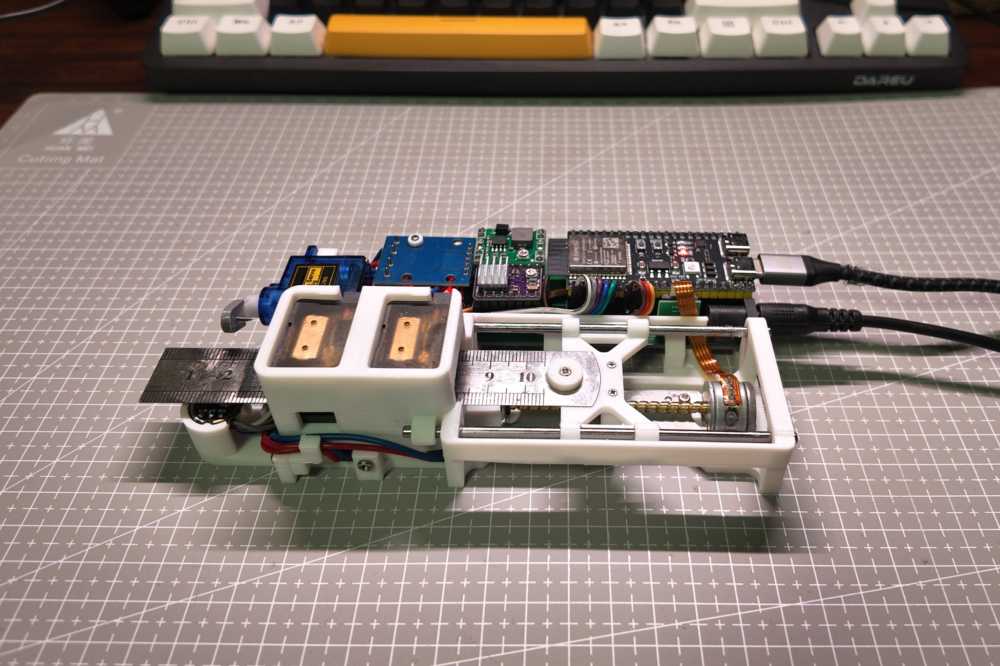

# 📏 Cyberuler: A Self-Playing Ruler

> A fully automated, MIDI-controlled musical instrument made from a standard steel ruler. 

Welcome to the **Cyberuler** repository! This project bridges the gap between everyday stationery and embedded hardware engineering. By utilizing stepper motors, high-speed servos, and acoustic frequency analysis, a common steel ruler is transformed into a precise, automated synthesizer.

This project is also the very first instrument in my ultimate hardware goal: **The Automated Stationery Band**.

## ✨ Features

* **Automated Plucking & Pitch Control:** Uses a stepper motor to slide the ruler for pitch changes and a servo to pluck the ruler.
* **Precise Acoustic Calibration:** Instead of guessing lengths, the firmware uses Fast Fourier Transform (FFT) via an I2S microphone to analyze the ruler's physical frequency response, generating a highly accurate calibration curve.
* **MIDI Integration:** Play the ruler live! Supports USB MIDI and standard MIDI inputs, allowing you to connect it to any MIDI keyboard or DAW.
* **Velocity Sensitivity:** The plucking servo responds to MIDI velocity data, hitting harder for louder notes and softer for quieter ones.
* **Fully Open-Source Hardware:** Custom PCB designs and 3D printable chassis files are included.

## 🛠️ Hardware Requirements

To build your own Cyberuler, you will need:
* **Microcontroller:** ESP32 (or similar MCU capable of handling I2S and fast motor control).
* **Motors:** 
  * 1x Stepper Motor (with a lead screw for linear motion).
  * 2x High-speed Servos (e.g., TowerPro SG90 or similar).
* **Audio Input:** INMP441 I2S Omnidirectional Microphone (for frequency calibration).
* **Mechanics:** 150mm Steel Ruler, 3D printed parts (models provided), rails, and bearings.
* **Custom PCB:** (Gerber files included in the `PCB` directory).

## 📂 Repository Structure

* `/3D_Models/`: STL and STEP files for the 3D-printed chassis and motor mounts. Contains the latest `.p2d` files to fix SolidWorks texture errors.
* `/PCB/`: Gerber files and schematics for the custom ESP32 expansion board.
* `/Firmware/`: C/C++ source code for the microcontroller, including FFT analysis, MIDI parsing, and motor control logic.
* `/Legacy/`: Archived older versions of models and early prototype code.

## 🚀 Getting Started

1. **Print the Parts:** Grab the files from the `/3D_Models/` folder and print them.
2. **Assemble the Hardware:** Mount the motors, insert the steel ruler, and connect the custom PCB.
3. **Flash the Firmware:** Compile and upload the code from the `/Firmware/` directory to your ESP32.
4. **Calibrate:** Run the initial calibration sequence. The microphone will listen as the ruler is plucked at various lengths to build the pitch map.
5. **Play!** Plug in a USB MIDI keyboard and start playing.

## 🗺️ Roadmap: The Stationery Band

The Cyberuler is just the beginning. I have a passion for blending embedded software development with DIY hardware integration, and the goal is to build a full desk-sized orchestra. 

* [x] **The Guitar/Bass:** Cyberuler (This project)
* [ ] **The Flute:** Automated Wind Pen 
* [ ] **The Drums:** Percussive Pen and Desk Tappers
* [ ] **The Conductor:** Central sync hub for all instruments

## 🤝 Contributing

Pull requests are always welcome! Whether it's optimizing the motor control algorithm, improving the 3D models, or adding new MIDI features, feel free to fork the repo and submit a PR.

## 📄 License

This project is licensed under the MIT License - see the LICENSE file for details.
