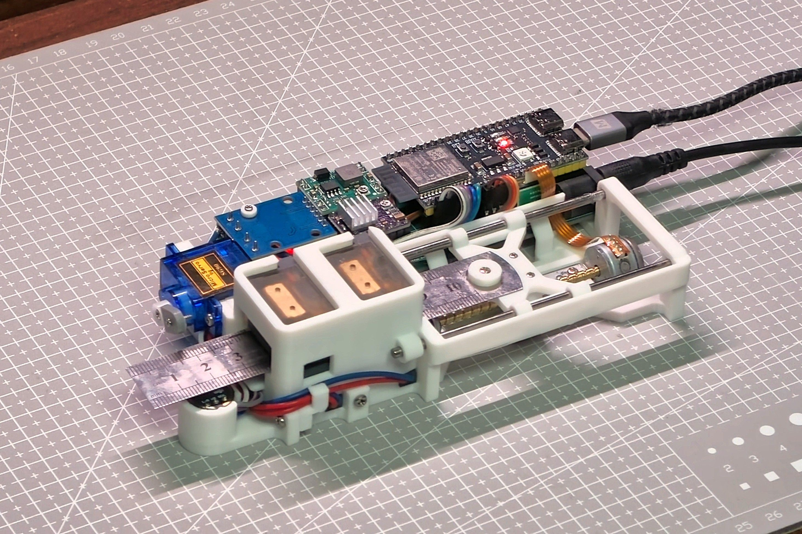
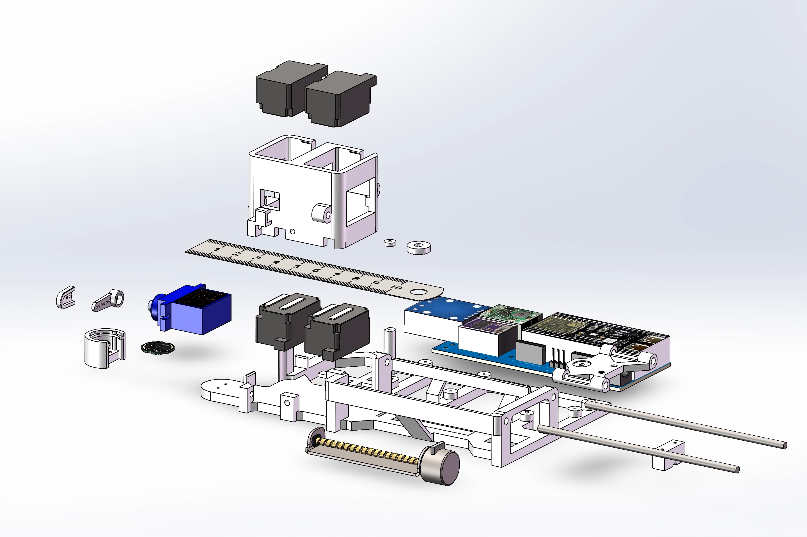
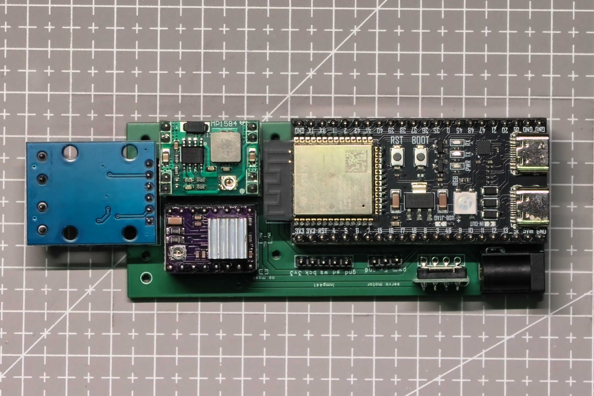
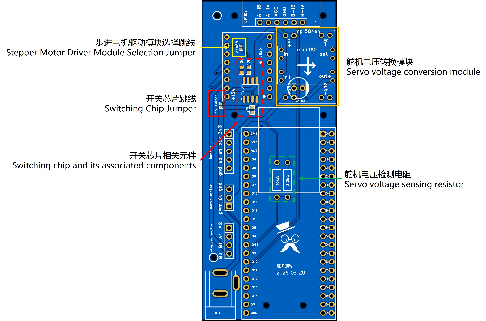
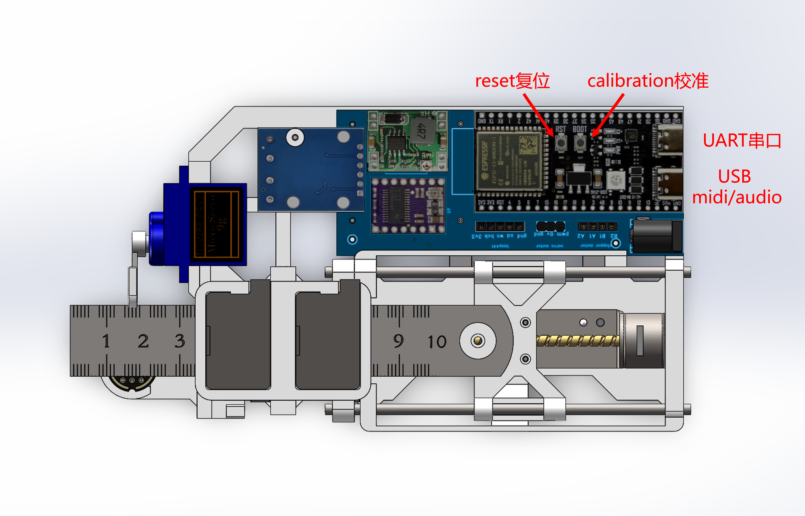
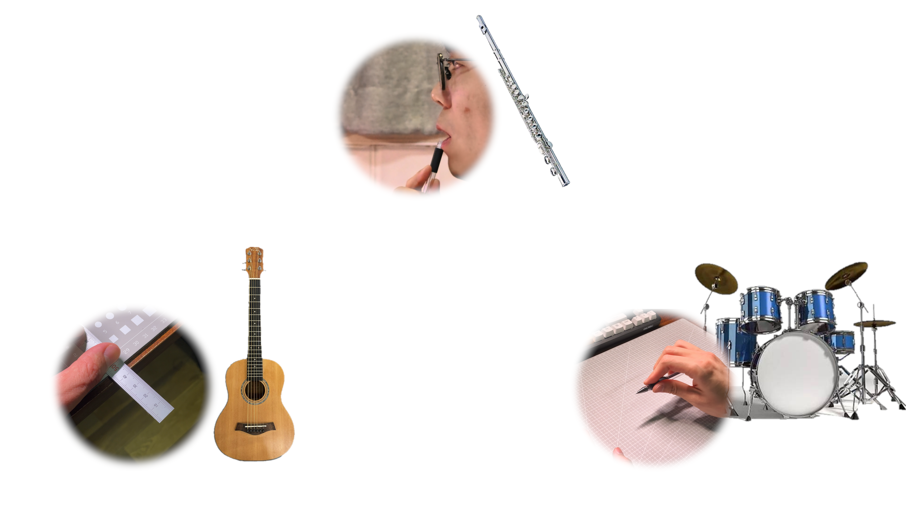

# 赛博钢尺琴——自动演奏的钢尺

[English](README.md) | [中文](README_zh.md)

[](https://creativecommons.org/licenses/by-nc-sa/4.0/)
[]()



> 一个将普通钢尺变成自动演奏乐器的项目——通过步进电机、舵机、电磁铁和 MIDI 驱动。

## 目录

- ✨ [特性](#特性)
- 🎵 [关于音色](#关于音色)
- 📂 [仓库结构](#仓库结构)
- 🛠️ [硬件概览](#硬件概览)
- ⚙️ [PCB 配置选项](#pcb-配置选项)
- 🚀 [快速开始](#快速开始)
  - [编译环境](#编译环境)
  - [串口终端命令](#串口终端命令)
- 🗺️ [路线图](#路线图)
- 👤 [作者](#作者)
- 📄 [开源协议](#开源协议)

## 🎥 演示视频

[](https://www.bilibili.com/video/BV1fZ9hBnEL7)

<a id="特性"></a>
## ✨ 特性

- **音高控制：** 步进电机带动丝杆滑动钢尺，改变有效振动长度，产生不同音高。
- **拨弦机构：** 高速舵机拨动钢尺发声。四个电磁铁（H桥驱动，上下各两个）压紧和释放钢尺，实现干净的音符切换。
- **声学校准：** INMP441 I2S 麦克风采集钢尺的真实声学响应，通过快速傅里叶变换（FFT）自动建立频率-位置映射表，无需手动调音。
- **NLS 曲线拟合：** 使用 Levenberg-Marquardt 非线性最小二乘法，将实测频率数据拟合为 `f = k/(pos + a)² + b` 模型，实现全音域精准音高插值。
- **USB MIDI 输入：** 通过 TinyUSB 协议栈模拟 USB MIDI 设备，接收 Note On/Off 消息并支持力度感应——连接任意 MIDI 键盘或 DAW 即可实时演奏。
- **USB 麦克风：** I2S 麦克风同时作为 USB Audio（UAC 2.0）输入设备——钢尺琴也是一支电脑可用的 USB 麦克风。
- **串口终端 REPL：** 内置命令行交互界面，支持行编辑、ANSI 方向键导航、命令历史。可完全控制电机、校准和诊断调试。

<a id="关于音色"></a>
## 🎵 关于音色

琴弦（吉他、钢琴）遵循波动方程，泛音是基频的整数倍，听感和谐。而钢尺本质上是一端固定、一端自由的悬臂梁，遵循欧拉-伯努利梁方程。在此边界条件下，其固有频率为：

$$\omega_n = \beta_n^2 \sqrt{\frac{EI}{\rho A L^4}}$$

其中 $\beta_n$ 是超越方程 $1 + \cos\beta \cosh\beta = 0$ 的第 n 个正根。第一个泛音约为基频的 **6.26 倍**，第二个约为 **17.55 倍**，均非整数倍关系。

这意味着钢尺的泛音结构天然不和谐。校准可以保证基频准确，但泛音结构由物理规律决定——这件乐器的音色本身就带着原始、略带"不准"的质感。这不是缺陷，而是它的声音特征。

<a id="仓库结构"></a>
## 📂 仓库结构

| 目录 | 说明 |
|---|---|
| `v1/code/` | ESP-IDF 固件（C）—— 电机控制、FFT、USB MIDI、REPL 终端 |
| `v1/model_A_1.2/` | SolidWorks 3D 模型 + 可打印 STL 文件 |
| `v1/model_legacy/` | 旧版模型存档（A_1.0、A_1.1、B） |
| `v1/pcb/` | PCB 设计文件（STEP、Gerber），[嘉立创开源项目](https://oshwhub.com/stccff/self_play_ruler) |
| `v1/bom_zh.xlsx` | 物料清单 |
| `prototype/` | 早期原型——固件、Python 上位机脚本、3D 模型 |
| `tools/` | 辅助工具与驱动 |
| `picture/` | 项目照片、渲染图、示意图 |

<a id="硬件概览"></a>
## 🛠️ 硬件概览

- **主控：** ESP32-S3 DevKitC 开发板
- **PCB：** 自制主板（嘉立创打样）—— 集成电源、电机驱动、麦克风、USB MIDI、USB Audio。Gerber 文件见 `v1/pcb/`，[嘉立创开源项目页](https://oshwhub.com/stccff/self_play_ruler)
- **步进驱动：** DRV8825 模块（可选 A4988）
- **电磁铁驱动：** L9110S 模块
- **电压转换：** MP1845EN 模块（可选 Mini360）
- **步进电机：** 光驱拆机丝杆步进电机
- **舵机：** SG90（拨弦）
- **电磁铁：** x4 —— 上下各两个
- **音频：** INMP441 I2S 麦克风
- **供电：** 12V DC 圆口电源（需外部电源适配器）
- **结构：** 3D 打印外壳 + 150mm 钢尺





详细物料清单见 `v1/bom_zh.xlsx`。

> ⚠️ **注意事项：**
> - ESP32-S3 DevKitC 开发板由 USB 供电，12V 仅用于驱动电机和电磁铁——仅插入 12V 而不接 USB，设备无法工作。
> - 如果 PCB 上**未选装 SGM2521YS8** 开关芯片，切勿在 12V 供电保持连接的情况下拔除 USB。这会切断 ESP32 电源，导致 DRV8825 的控制引脚悬空，步进电机进入异常状态发热。
> - **SG90 舵机供电电压需调至 6V**。固件中的拨弦时序按 6V 标定，电压不足会导致舵机变慢、时序错乱。
> - **DRV8825 需调节限流**，电流过小步进电机会丢步，过大会导致电机发热。

<a id="快速开始"></a>
<a id="pcb-配置选项"></a>
## ⚙️ PCB 配置选项



- **步进驱动：** 默认 DRV8825，可选 A4988——选 A4988 时需焊接跳线。
- **舵机电压转换：** 默认 MP1845EN，可选 Mini360。
- **开关芯片（SGM2521YS8）：** 可选——防止单片机断电后步进驱动进入异常状态（见上方注意事项）。
- **舵机电压检测电阻：** 可选——无需万用表，通过开发板 ADC 即可检测并调节舵机电压。

## 🚀 快速开始

1. **打印零件：** STL 文件在 `v1/model_A_1.2/output/`。
2. **组装硬件：** 将电机、钢尺、电磁铁和 PCB 安装到打印好的外壳上。
3. **烧录固件：** 使用 ESP-IDF 编译 `v1/code/` 中的工程，烧录至 ESP32-S3。
4. **校准：** 按下开发板上的 BOOT 按键（单击即可触发自动校准），或通过串口终端执行 `ftinit` 命令，麦克风将依次拨动钢尺并采集各位置频率，自动建立音高映射表。


5. **演奏：** 连接 USB MIDI 键盘，或通过串口终端（`p` 命令）直接弹奏。

### 编译环境

- **ESP-IDF** v5.0 或更高版本（目标芯片：ESP32-S3）
- 依赖组件（IDF Component Manager 自动拉取）：
  - `espressif/esp-dsp` — FFT 数学库
  - `espressif/tinyusb` — USB MIDI 设备协议栈
  - `espressif/button` — GPIO 按键驱动
  - `espressif/led_strip` — WS2812 RGB LED 驱动

```bash
cd v1/code
idf.py set-target esp32s3
idf.py build
idf.py -p <端口> flash
```

### 串口终端命令

通过 UART（115200 波特率）连接即可进入 REPL 交互界面。常用命令：

| 命令 | 说明 |
|---|---|
| `help` | 列出全部可用命令 |
| `ftinit` | 重建频率校准表 |
| `p <音符>` | 用简谱符号弹奏一个音（如 `p 1.`） |
| `midivelocity <0\|1>` | 开关 MIDI 力度感应 |
| `compiletime` | 打印固件编译时间 |

<a id="路线图"></a>
## 🗺️ 路线图：文具乐队

自弹尺琴是一个更大愿景中的第一件乐器——用日常文具打造一个桌面自动管弦乐团。



- [x] **吉他/贝斯：** Cyberuler（本项目）
- [ ] **长笛：** 自动吹奏笔
- [ ] **鼓组：** 敲击笔与桌面节拍器
- [ ] **指挥：** 多乐器同步中枢

<a id="作者"></a>
## 👤 作者

**stccff** — [github.com/stccff](https://github.com/stccff) — [913602792@qq.com](mailto:913602792@qq.com)

欢迎反馈、提问和分享你的制作故事。如果你也做了一台，我很想看看。

<a id="开源协议"></a>
## 📄 开源协议

本项目基于 [CC BY-NC-SA 4.0](https://creativecommons.org/licenses/by-nc-sa/4.0/) 协议发布——您可以自由分享、改编，但仅限于非商业用途，且需署名并以相同协议共享。

详见 [LICENSE](LICENSE) 文件。
